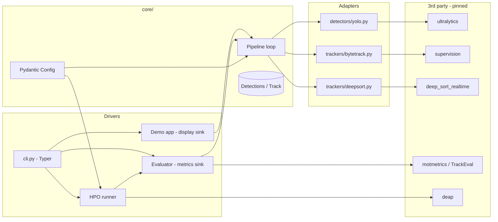

# Software Requirements Specification (SRS)
## CCTV Multi-Object Tracking & Hyperparameter Optimization System

| | |
|---|---|
| **Project** | cctv_tracking_system |
| **Document version** | 1.0 |
| **Date** | 2026-07-19 |
| **Status** | Draft — baseline for the v2 rebuild |
| **Author** | Harshit Deswal (compiled from senior technical audit) |

---

## Table of Contents

1. [Introduction](#1-introduction)
2. [Overall Description](#2-overall-description)
3. [Current-State Assessment (Audit Baseline)](#3-current-state-assessment-audit-baseline)
4. [Functional Requirements](#4-functional-requirements)
5. [Non-Functional Requirements](#5-non-functional-requirements)
6. [Target System Architecture](#6-target-system-architecture)
7. [Data Design](#7-data-design)
8. [External Interfaces](#8-external-interfaces)
9. [ML Engineering Requirements](#9-ml-engineering-requirements)
10. [Testing & Quality Requirements](#10-testing--quality-requirements)
11. [DevOps & Delivery Requirements](#11-devops--delivery-requirements)
12. [Security, Privacy & Compliance](#12-security-privacy--compliance)
13. [Migration Roadmap](#13-migration-roadmap)
14. [Traceability Matrix](#14-traceability-matrix)
15. [Glossary](#15-glossary)

---

## 1. Introduction

### 1.1 Purpose
This document specifies the requirements and target architecture for the CCTV Tracking System: a person **detection + multi-object tracking (MOT)** pipeline with an **evolutionary hyperparameter-optimization (HPO)** layer that tunes the pipeline for the best trade-off between tracking accuracy (MOTA, IDF1) and throughput (FPS).

It serves three purposes:

1. **Requirements baseline** — what the system must do (functional) and how well (non-functional), each with an ID, priority, and acceptance criterion.
2. **Architecture specification** — the target module layout, data contracts, and technology choices, aligned with current (2026) Python/ML engineering standards.
3. **Remediation contract** — every defect found in the technical audit of the existing codebase is mapped to a requirement that closes it (see §14 Traceability Matrix).

### 1.2 Scope

**In scope (v2):**
- Offline video-file tracking pipeline: YOLO detector → pluggable tracker (ByteTrack / DeepSORT) → annotated output + metrics.
- Ground-truth evaluation against MOT-format datasets (MOT20) producing **real** MOTA / IDF1 / HOTA / FPS.
- Batch HPO experiments: QPSO, NSGA-II, MOPSO over a declared search space, with reproducible, versioned results.
- Interactive suspect-selection demo (single stream, local display).
- CLI entry points, packaging, tests, CI.

**Out of scope (v2, deferred to v3 — see §13):**
- Live RTSP ingestion, multi-camera orchestration, REST/gRPC serving layer, web UI, alerting, model registry service.

### 1.3 Definitions
See §15 Glossary.

### 1.4 Priority scheme
- **P0 (Must / release-blocking)** — system is incorrect or unreproducible without it.
- **P1 (Should)** — expected of a professional codebase; schedule in v2.
- **P2 (Could)** — valuable, schedule when v2 is stable.

---

## 2. Overall Description

### 2.1 Product perspective
A modular Python 3.11+ application, installed as a package (`cctv_tracking`), operated through a single CLI. It is a **research/benchmarking system first**; the architecture must not preclude a later serving layer (v3) but must not build one prematurely.

### 2.2 User classes
| User | Needs |
|---|---|
| ML researcher (primary) | Run reproducible HPO experiments, compare trackers/embedders, generate Pareto plots and tables usable in a report/thesis. |
| Developer | Extend detectors/trackers behind stable interfaces; trust CI to catch regressions. |
| Demo operator | Run the interactive tracking demo on a video file; click to mark/unmark a suspect. |

### 2.3 Operating environment
- Linux (primary), Python **≥ 3.11**, CUDA GPU optional (CPU fallback mandatory).
- No network dependency at runtime except first-run model weight download.

### 2.4 Constraints & assumptions
- MOT20 dataset available locally for evaluation (path supplied via config, never hardcoded).
- Model weights are **not** stored in git (see NFR-REP-4).
- Single-node execution; distributed training/eval out of scope.

---

## 3. Current-State Assessment (Audit Baseline)

Summary of the audit findings this SRS remediates. Full detail lives in the audit report; IDs below are referenced throughout this document.

| ID | Severity | Finding |
|---|---|---|
| **C1** | Critical | Evaluation metrics (MOTA/IDF1) are mocked — a modulo function of track count. All optimizer results are fabricated. |
| **C2** | Critical | Evaluation opens a non-existent video, never checks `cap.isOpened()`; all committed results ran on **0 frames** (FPS = 0.001 sentinel leaked into results). |
| **C3** | Critical | The `embedder` experiment variable is never passed into the pipeline; the 3×3 experiment matrix is actually 1×3 with fake labels. |
| **C4** | Critical | ByteTrack wrapper calls `BYTETracker` with a wrong constructor and wrong `update()` signature; cannot run against stock YOLOX. |
| **C5** | Critical | No dependency manifest of any kind; environment unreproducible. |
| **H1** | High | Three duplicated detector modules with divergent defaults; demo and evaluator silently use different ones. |
| **H2** | High | Demo uses ByteTrack while the optimizer evaluates DeepSORT — the "optimal" config is for a tracker the demo doesn't run. |
| **H3** | High | Errors swallowed (bare `except`, unchecked `VideoWriter`, fourcc typo `"mp0v"`); failures produce garbage silently. |
| **H4** | High | QPSO/MOPSO scoring is lexicographic (not Pareto) **and inverted** — slower configs preferred on ties. MOPSO re-evaluates personal bests, doubling runtime. |
| **H5** | High | Zero tests, zero CI. |
| **H6** | High | README is one sentence; no install/run/dataset instructions. |
| **M1** | Medium | Optimizer helper functions triplicated and already drifted (missing `os.makedirs` in two copies). |
| **M2** | Medium | Model reloaded from disk on every evaluation (~9,000 loads per full batch); no evaluation cache despite a 48-config discrete space. |
| **M3** | Medium | Config search space conflates "range" and "choice" parameters — continuous params can only take their endpoint values. |
| **M4** | Medium | Append-only result files with no run ID; results from different code versions indistinguishable. |
| **M5** | Medium | `skip_interval` drops tracks instead of skipping detection; saves no compute and corrupts metrics. |
| **M6** | Medium | Pickle-based `.pt` weights (134 MB) committed to git; stray `=` conda-log file committed; 296 MB of outputs in git. |
| **L1** | Low | Dead/broken files (`run_plot_pareto.py` crashes on import; unused `config.py`, `video_io.py`); commented-out code blocks; no type hints; no seeds. |

---

## 4. Functional Requirements

### 4.1 Detection (FR-DET)

| ID | Priority | Requirement |
|---|---|---|
| FR-DET-1 | P0 | The system SHALL provide exactly **one** detector implementation module exposing a `Detector` protocol: `detect(frame: np.ndarray) -> Detections`. *(closes H1)* |
| FR-DET-2 | P0 | Detector model name, confidence threshold, image size, and device SHALL be injected via configuration — no in-code defaults divergence between call sites. |
| FR-DET-3 | P1 | The detector SHALL support class filtering (person-only) at the detector boundary, not at every call site. |
| FR-DET-4 | P2 | The detector SHALL support batched inference over N frames to amortize GPU transfer cost. |

### 4.2 Tracking (FR-TRK)

| ID | Priority | Requirement |
|---|---|---|
| FR-TRK-1 | P0 | The system SHALL define a `Tracker` protocol: `update(detections: Detections, frame: np.ndarray) -> list[Track]`, implemented by ByteTrack and DeepSORT adapters. Both adapters SHALL accept the **same** `Detections` type. *(closes C4, dtype hazard)* |
| FR-TRK-2 | P0 | The ByteTrack adapter SHALL call the upstream library with its documented signature (args namespace; `update(dets, img_info, img_size)`), against a **pinned** version. Preferred: use the `supervision` library's maintained ByteTrack implementation instead of vendoring YOLOX. *(closes C4)* |
| FR-TRK-3 | P0 | The active tracker SHALL be selected by configuration (`tracker: bytetrack \| deepsort`); the demo and the evaluator SHALL run the identical pipeline code path. *(closes H2)* |
| FR-TRK-4 | P0 | The DeepSORT adapter SHALL accept an `embedder` parameter (`mobilenet`, `torchreid` variants, etc.) plumbed from experiment config to the underlying library. *(closes C3)* |
| FR-TRK-5 | P1 | Frame skipping SHALL skip **detection** (the expensive stage) while the tracker coasts/predicts on skipped frames; tracks SHALL never be silently dropped on skipped frames. *(closes M5)* |

### 4.3 Evaluation (FR-EVAL)

| ID | Priority | Requirement |
|---|---|---|
| FR-EVAL-1 | P0 | The system SHALL compute **real** MOT metrics — MOTA, IDF1, and HOTA — against MOT-format ground truth using an established library (`motmetrics` or `TrackEval`). Mock metrics SHALL NOT exist anywhere in the codebase. *(closes C1)* |
| FR-EVAL-2 | P0 | Evaluation SHALL fail fast with a clear exception if the input video or ground-truth file cannot be opened, and SHALL assert `frames_processed > 0` before reporting. Sentinel values SHALL never be written to results. *(closes C2)* |
| FR-EVAL-3 | P0 | FPS SHALL be measured per pipeline stage (detect / embed / associate) and end-to-end, excluding video-decode time from the model-throughput figure. |
| FR-EVAL-4 | P1 | The evaluator SHALL emit a machine-readable `EvalResult` (Pydantic model → JSON) containing: metrics, config used, dataset/sequence ID, run ID, git SHA, timestamps, hardware info. *(closes M4)* |
| FR-EVAL-5 | P1 | A dataset-preparation command SHALL convert MOT image sequences to video (replacing `video_generation.py`) with all paths as CLI arguments. |

### 4.4 Hyperparameter Optimization (FR-OPT)

| ID | Priority | Requirement |
|---|---|---|
| FR-OPT-1 | P0 | QPSO, NSGA-II, and MOPSO SHALL optimize the **real** objective vector (MOTA↑, IDF1↑, FPS↑) using genuine Pareto dominance (or an explicitly documented scalarization). Lexicographic tuple comparison SHALL NOT be used. *(closes H4)* |
| FR-OPT-2 | P0 | The search-space schema SHALL distinguish `range: [lo, hi]` (continuous), `int_range`, and `choice: [...]` (categorical) parameters. Continuous parameters SHALL be explorable across their full range. *(closes M3)* |
| FR-OPT-3 | P0 | Shared optimizer utilities (config loading, quantization, logging) SHALL live in exactly one module. *(closes M1)* |
| FR-OPT-4 | P0 | Fitness evaluations SHALL be memoized keyed by the quantized config; personal/global bests SHALL cache their scores — never re-evaluate a config already scored in the same run. *(closes H4, M2)* |
| FR-OPT-5 | P0 | The experiment matrix (embedder × optimizer) SHALL actually vary the embedder end-to-end. *(closes C3)* |
| FR-OPT-6 | P1 | All RNGs (`random`, `numpy`, `torch`) SHALL be seeded from a single configured seed recorded in the run manifest. *(closes L1)* |
| FR-OPT-7 | P1 | Model instances SHALL be cached across evaluations keyed by `(model_name, device)`; per-config parameters (conf, imgsz) passed at predict time. *(closes M2)* |
| FR-OPT-8 | P2 | The system SHOULD additionally expose an [Optuna](https://optuna.org) baseline (TPE / NSGA-II sampler) as a reference optimizer — current-standard practice for HPO and a sanity check on the custom metaheuristics. |

### 4.5 Interactive Demo (FR-DEMO)

| ID | Priority | Requirement |
|---|---|---|
| FR-DEMO-1 | P0 | The demo SHALL run the same `Pipeline` object as evaluation (only the sink differs: display + annotated writer vs. metrics accumulator). *(closes H2)* |
| FR-DEMO-2 | P0 | Clicking a tracked person toggles suspect status (red highlight); clicking background clears it. State SHALL live in an app class, not module globals. |
| FR-DEMO-3 | P0 | Output video writing SHALL verify `VideoWriter.isOpened()` and use a valid fourcc (`mp4v`/`avc1`); Ctrl-C SHALL release resources cleanly (finally/context managers). *(closes H3)* |
| FR-DEMO-4 | P1 | The demo SHALL run headless (`--no-display`) writing the annotated video only, so it works on servers/CI. |
| FR-DEMO-5 | P2 | On-screen overlay SHALL show only honestly computable live values (FPS, track count) — never fabricated accuracy metrics. *(closes C1)* |

### 4.6 CLI (FR-CLI)

| ID | Priority | Requirement |
|---|---|---|
| FR-CLI-1 | P0 | One console entry point (`cctv`) with subcommands: `track` (demo), `evaluate`, `optimize`, `plot`, `prepare-data`. Implemented with **Typer** (or argparse). No runnable logic at module import scope. |
| FR-CLI-2 | P0 | Every path, device, and hyperparameter SHALL be settable via config file + CLI override; nothing user-specific hardcoded. |

---

## 5. Non-Functional Requirements

### 5.1 Reproducibility (NFR-REP) — the defining NFR for a research system

| ID | Priority | Requirement |
|---|---|---|
| NFR-REP-1 | P0 | Dependency management via **`pyproject.toml` + `uv` lockfile** (`uv.lock`). Fresh-machine setup = `uv sync`, nothing else. *(closes C5)* |
| NFR-REP-2 | P0 | Every experiment run SHALL produce a **run manifest** (run ID = timestamp + git SHA, config, seed, package versions, hardware) stored alongside its results in `results/runs/<run_id>/`. *(closes M4)* |
| NFR-REP-3 | P0 | Identical (config, seed, dataset) SHALL reproduce identical metric values on the same hardware (within documented FP nondeterminism for GPU). |
| NFR-REP-4 | P0 | Model weights SHALL NOT be committed to git. Weights are fetched on first use (ultralytics auto-download) with the model version pinned; checksums recorded in the manifest. *(closes M6)* |
| NFR-REP-5 | P1 | Datasets and large artifacts tracked outside git — **DVC** (or documented external storage) rather than Git LFS for multi-hundred-MB outputs. *(closes M6)* |

### 5.2 Performance (NFR-PERF)

| ID | Priority | Requirement |
|---|---|---|
| NFR-PERF-1 | P0 | A full HPO batch SHALL NOT evaluate the same quantized config twice (memoization); MOPSO cost per generation is O(particles), not O(2 × particles). *(closes H4, M2)* |
| NFR-PERF-2 | P1 | Model load happens once per (model, device) per process, not per evaluation. Target: evaluation setup overhead < 2 s after warm-up. *(closes M2)* |
| NFR-PERF-3 | P1 | Demo memory is bounded: rolling track-history window, no unbounded `all_tracks` accumulation. |
| NFR-PERF-4 | P2 | Independent experiment combos MAY run in parallel workers (process pool), GPU-memory permitting. |
| NFR-PERF-5 | P2 | Detector SHOULD support ONNX Runtime / TensorRT export path for deployment benchmarking. |

### 5.3 Reliability (NFR-REL)

| ID | Priority | Requirement |
|---|---|---|
| NFR-REL-1 | P0 | **Fail-fast policy**: setup errors (missing files, unopened captures/writers, bad config) raise immediately with actionable messages. Broad `except Exception` is forbidden except at the batch-runner top level, where it SHALL log the full traceback and mark the combo as failed in the summary. *(closes H3)* |
| NFR-REL-2 | P0 | Config files validated at load time with **Pydantic v2** models — unknown keys, out-of-range values, and type errors rejected before any GPU time is spent. |
| NFR-REL-3 | P1 | Long batch runs SHALL be resumable: completed combos detected via run manifests and skipped. |

### 5.4 Maintainability (NFR-MNT)

| ID | Priority | Requirement |
|---|---|---|
| NFR-MNT-1 | P0 | Full type annotations on all public interfaces; **mypy (strict on `core/`)** passes in CI. Data crossing module boundaries uses typed dataclasses/Pydantic models, not bare lists/tuples. *(closes L1, C4-class bugs)* |
| NFR-MNT-2 | P0 | **ruff** (lint + format) enforced via pre-commit and CI; no commented-out code blocks; no dead modules. *(closes L1)* |
| NFR-MNT-3 | P0 | No duplicated implementations: one detector, one shared optimizer-utils module, one video-processing loop. *(closes H1, M1)* |
| NFR-MNT-4 | P1 | Logging via the stdlib `logging` (or `structlog`) with levels and per-run log files; `print()` only in CLI presentation code. |

---

## 6. Target System Architecture

### 6.1 Design principles

1. **One pipeline, many frontends.** Detection→tracking is a single composable `Pipeline`; the demo, the evaluator, and the optimizer are thin drivers around it. This is the structural fix for C1/C2/H2 ever recurring.
2. **Ports & adapters.** Third-party libraries (ultralytics, yolox/supervision, deep_sort_realtime, deap) are wrapped behind small Protocols owned by `core/`. Upstream API churn stays in the adapter.
3. **Typed data contracts.** `Detections` and `Track` are the only currencies between stages — no positional list conventions.
4. **Config as data.** One Pydantic-validated config tree; CLI flags override file values; the resolved config is frozen into every run manifest.
5. **Results are immutable.** A run writes to its own `results/runs/<run_id>/` directory and never appends to shared files.

### 6.2 Package layout

```
cctv_tracking_system/
├── pyproject.toml               # packaging, deps, ruff/mypy/pytest config
├── uv.lock
├── README.md                    # install, dataset prep, run, experiment guide
├── .pre-commit-config.yaml
├── .github/workflows/ci.yml
├── configs/
│   ├── default.yaml             # pipeline defaults (model, tracker, device…)
│   └── search_space.yaml        # HPO space: range/int_range/choice per param
├── src/cctv_tracking/
│   ├── core/
│   │   ├── types.py             # Detections, Track, EvalResult, RunManifest
│   │   ├── config.py            # Pydantic settings models + loader
│   │   ├── protocols.py         # Detector, Tracker, FrameSink Protocols
│   │   └── pipeline.py          # THE processing loop (detect→track→sink)
│   ├── detectors/
│   │   └── yolo.py              # single ultralytics adapter (FR-DET-1)
│   ├── trackers/
│   │   ├── bytetrack.py         # supervision-based adapter (FR-TRK-2)
│   │   └── deepsort.py          # embedder-parameterized adapter (FR-TRK-4)
│   ├── evaluation/
│   │   ├── mot_metrics.py       # motmetrics/TrackEval integration (FR-EVAL-1)
│   │   └── evaluator.py         # runs Pipeline w/ MetricsSink → EvalResult
│   ├── optimization/
│   │   ├── common.py            # space parsing, quantize, memo cache, logging
│   │   ├── objectives.py        # Pareto dominance / scalarization (FR-OPT-1)
│   │   ├── qpso.py  nsga.py  mopso.py
│   │   └── runner.py            # experiment matrix, manifests, resume
│   ├── viz/
│   │   └── pareto.py            # 2D/3D Pareto plots from run artifacts
│   ├── data/
│   │   └── mot_prep.py          # MOT frames → video (FR-EVAL-5)
│   └── cli.py                   # Typer app: track/evaluate/optimize/plot
├── tests/
│   ├── unit/                    # space parsing, quantize, dominance, types
│   ├── integration/             # 10-frame smoke eval, wrapper contracts
│   └── data/tiny_clip.mp4       # tiny fixture (few hundred KB)
├── datasets/                    # gitignored / DVC-tracked
└── results/                     # gitignored; runs/<run_id>/ per experiment
```

### 6.3 Component diagram



Dependency rule: `core/` imports nothing from adapters or drivers; adapters import `core.types` + their external library; drivers compose everything. This keeps the graph a DAG and makes every seam mockable in tests.

### 6.4 Key data contracts (normative)

```python
# core/types.py  (illustrative — normative shape, not final code)
from dataclasses import dataclass
import numpy as np

@dataclass(frozen=True, slots=True)
class Detections:
    xyxy: np.ndarray        # (N, 4) float32
    confidence: np.ndarray  # (N,)  float32
    class_id: np.ndarray    # (N,)  int32

@dataclass(frozen=True, slots=True)
class Track:
    track_id: int
    xyxy: tuple[float, float, float, float]
    confidence: float

class Detector(Protocol):
    def detect(self, frame: np.ndarray) -> Detections: ...

class Tracker(Protocol):
    def update(self, dets: Detections, frame: np.ndarray) -> list[Track]: ...
```

`EvalResult` and `RunManifest` are Pydantic models serialized to JSON per run (FR-EVAL-4, NFR-REP-2).

### 6.5 Technology decisions (2026 standards)

| Concern | Choice | Rationale |
|---|---|---|
| Packaging / env | `pyproject.toml` + **uv** | Current de-facto standard; lockfile = reproducibility (C5). |
| Lint / format | **ruff** (single tool) | Replaces black+flake8+isort. |
| Types | mypy strict on `core/`; gradual elsewhere | Catches C4-class interface bugs statically. |
| Config | **Pydantic v2** + YAML | Validation at the boundary (NFR-REL-2). |
| CLI | **Typer** | Typed, self-documenting `--help`. |
| Detector | **ultralytics** (YOLOv8 or current YOLO11), pinned | Auto weight download kills committed `.pt` files (M6). |
| ByteTrack | **supervision** library | Maintained, correct API; avoids vendoring YOLOX (C4). |
| MOT metrics | **motmetrics** (+ TrackEval for HOTA) | The accepted implementations; ends mock metrics (C1). |
| HPO baseline | **Optuna** alongside custom QPSO/NSGA/MOPSO | Standard practice; validates the custom optimizers. |
| Experiment tracking | Run manifests now; **MLflow or W&B** optional P2 | Manifests are the P0; tracking UI is a bonus. |
| Data versioning | **DVC** or documented external store | Git LFS is the wrong tool for 300 MB of outputs. |
| CI | **GitHub Actions** | ruff + mypy + pytest on every push/PR. |

---

## 7. Data Design

### 7.1 Search-space schema (`configs/search_space.yaml`) — replaces flat lists (M3)

```yaml
img_size:          { type: choice,    values: [320, 640, 960] }
conf_thresh:       { type: range,     low: 0.2, high: 0.8 }
iou_thresh:        { type: range,     low: 0.3, high: 0.7 }
skip_interval:     { type: int_range, low: 1,   high: 5 }
appearance_weight: { type: range,     low: 0.0, high: 1.0 }   # deepsort only
```

Parser rules: `choice` → nearest-value quantization; `range` → clamp only; `int_range` → round + clamp. Tracker-specific params are validated against the active tracker (an `appearance_weight` with ByteTrack is a config error, not a silent no-op).

### 7.2 Results layout (immutable, per-run)

```
results/runs/<run_id>/            # run_id = 20260719T1030Z_a1b2c3d
├── manifest.json                 # config, seed, git SHA, versions, hardware
├── eval_log.csv                  # one row per fitness evaluation
├── pareto_front.json             # final non-dominated set
├── metrics.json                  # best config + real MOTA/IDF1/HOTA/FPS
└── plots/{pareto_2d.png, pareto_3d.png}
results/summary.csv               # regenerated (not appended) from run manifests
```

### 7.3 Dataset layout

```
datasets/MOT20/train/MOT20-05/{img1/, gt/gt.txt, seqinfo.ini}
datasets/videos/mot20-05.mp4      # produced by `cctv prepare-data`
```

Ground truth is parsed per MOTChallenge format; sequence FPS is read from `seqinfo.ini`, never hardcoded.

---

## 8. External Interfaces

### 8.1 CLI (the only v2 interface)

```
cctv track      --video PATH [--config configs/default.yaml] [--tracker bytetrack|deepsort]
                [--no-display] [--output PATH]
cctv evaluate   --video PATH --gt PATH [--config PATH] → prints + writes EvalResult
cctv optimize   --space configs/search_space.yaml --optimizer qpso|nsga|mopso|optuna
                [--embedder mobilenet|...] [--particles 20] [--generations 50] [--seed 42]
                [--resume]
cctv plot       --run results/runs/<run_id>
cctv prepare-data --mot-seq datasets/MOT20/train/MOT20-05 --out datasets/videos/
```

Exit codes: 0 success, 1 usage/config error, 2 runtime failure. All failures print the actionable cause (NFR-REL-1).

### 8.2 Future service API (v3, informative only)
When live streams are needed: FastAPI + WebSocket for track streams, RTSP ingestion workers, and a results store — specified in a separate v3 SRS. Nothing in v2 may hardcode single-stream assumptions into `core/` (e.g., no module-level state — already required by FR-DEMO-2).

---

## 9. ML Engineering Requirements

| ID | Priority | Requirement |
|---|---|---|
| ML-1 | P0 | **Honest metrics only.** Any metric displayed or persisted is computed from ground truth or direct measurement. (C1 is a project-integrity issue, not a code-style issue.) |
| ML-2 | P0 | Optimizers compared on equal footing: same seed policy, same evaluation budget, same dataset split; the comparison table reports evaluations-to-best alongside best score. |
| ML-3 | P0 | Multi-objective results reported as **Pareto fronts**, with hypervolume as the scalar comparison metric between optimizers — not a single "best" point chosen by an undocumented tie-break. *(closes H4 scientifically)* |
| ML-4 | P1 | Train/eval hygiene: HPO tunes on one sequence (or split) and the final config is validated on a **held-out** sequence; both numbers reported. Tuning and reporting on the same clip overfits the config. |
| ML-5 | P1 | Determinism policy documented: seeds set (FR-OPT-6), `torch.use_deterministic_algorithms` best-effort, known GPU nondeterminism noted in the manifest. |
| ML-6 | P2 | Model/embedder versions treated as experiment dimensions recorded in manifests, enabling later regression comparison across ultralytics upgrades. |

---

## 10. Testing & Quality Requirements

| ID | Priority | Requirement |
|---|---|---|
| TST-1 | P0 | **Smoke test**: `cctv evaluate` on the bundled 10-frame fixture asserts `frames_processed > 0`, `fps > 1`, metrics ∈ [0, 1]. (Would have caught C2 on day one.) |
| TST-2 | P0 | **Import/collection test**: every module imports cleanly (kills `run_plot_pareto.py`-class corpses). |
| TST-3 | P0 | Unit tests: search-space parsing (all three param types, boundary snapping), Pareto dominance (including the inverted-FPS case as a regression test), memo cache, config validation failures. |
| TST-4 | P0 | **Tracker contract test**: both adapters consume the same `Detections` fixture (incl. empty input) and return valid `Track` lists — locks the interface that C4 broke. |
| TST-5 | P1 | Integration test: 2-generation, 4-particle optimizer run on the fixture produces a manifest, log, and non-empty Pareto front, and memoization keeps evaluation count ≤ distinct configs. |
| TST-6 | P1 | Coverage gate ≥ 80 % on `core/`, `optimization/common.py`, `evaluation/` (measured, enforced in CI). GPU-dependent paths mocked in unit tier; real-model tests marked `@pytest.mark.slow`. |
| TST-7 | P2 | Golden-file test: metrics on the fixture clip pinned within tolerance to catch silent upstream-library behavior changes. |

---

## 11. DevOps & Delivery Requirements

| ID | Priority | Requirement |
|---|---|---|
| DEV-1 | P0 | GitHub Actions CI on push/PR: `uv sync` → ruff (lint+format check) → mypy → pytest (non-slow). Red CI blocks merge. *(closes H5)* |
| DEV-2 | P0 | Repo hygiene: proper Python `.gitignore` (`__pycache__`, `results/`, `datasets/`, `*.pt`); delete the stray `=` file, `result/` (296 MB), committed weights and outputs; purge from history with `git filter-repo` since LFS still bills for them. *(closes M6)* |
| DEV-3 | P0 | Pre-commit hooks: ruff, ruff-format, end-of-file/trailing-whitespace, `check-added-large-files` (blocks the next 84 MB `.pt` at commit time). |
| DEV-4 | P1 | Structured logging to `results/runs/<run_id>/run.log`; console shows INFO+, file records DEBUG+. Progress via `tqdm` only in TTY sessions. |
| DEV-5 | P1 | README per H6: install (2 commands), dataset prep, demo run, experiment run, results interpretation, troubleshooting (CUDA/CPU). A `Makefile`/`justfile` for `setup / lint / test / demo / experiment`. |
| DEV-6 | P2 | `Dockerfile` (CUDA base + uv) for portable experiment execution; `docker compose` profile for CPU-only. |
| DEV-7 | P2 | Release tagging: experiment result sets reference the git tag they were produced from. |

---

## 12. Security, Privacy & Compliance

| ID | Priority | Requirement |
|---|---|---|
| SEC-1 | P0 | No pickle-based weights in the repo; weights fetched from the pinned official source with checksum verification. *(closes M6)* |
| SEC-2 | P0 | No personal/user-specific absolute paths, credentials, or tokens in code or config (audit found `/home/harshit/...` paths). |
| SEC-3 | P1 | `yaml.safe_load` only (already the case — keep it enforced via lint rule). |
| SEC-4 | P1 | Sample footage limited to licensed research datasets (MOT20). A `PRIVACY.md` SHALL note that real CCTV deployment triggers biometric-data regulation (GDPR/DPDP), retention limits, and access-control obligations — explicitly out of scope for v2 and gating requirements for v3. |
| SEC-5 | P2 | Dependency audit (`pip-audit` / `uv audit`) in CI weekly. |

---

## 13. Migration Roadmap

Sequenced so that **scientific validity lands first**, structure second, polish third. Each phase leaves the repo green (CI passing).

### Phase 0 — Stop the bleeding (≈ 1 day) `P0`
1. Fix evaluation video path; add `cap.isOpened()` / `frames > 0` guards (C2).
2. Delete poisoned `results/`, stray `=`, `result/`, dead files (`run_plot_pareto.py`, `optimization/config.py`, `utils/video_io.py`) (L1, M6).
3. Add `requirements.txt` snapshot of the working env as an interim manifest (C5).
4. Fix `"mp0v"` fourcc + writer checks (H3).

### Phase 1 — Make the numbers real (≈ 3–5 days) `P0`
5. Implement `motmetrics`-based MOTA/IDF1 (+ HOTA via TrackEval) against MOT20 GT; delete `compute_mock_metrics` (C1 / FR-EVAL-1).
6. Fix ByteTrack adapter via `supervision`; unify demo & evaluator on one configurable pipeline (C4, H2 / FR-TRK-1..3).
7. Thread `embedder` end-to-end (C3 / FR-TRK-4).
8. Fix optimizer scoring: Pareto dominance, un-invert FPS, memoize evaluations, cache personal bests, seed RNGs (H4 / FR-OPT-1,4,6).
9. Re-run one full combo and sanity-check outputs by eye before re-running the matrix.

### Phase 2 — Restructure to target architecture (≈ 1 week) `P0/P1`
10. `pyproject.toml` + uv lock + `src/` layout + Typer CLI (NFR-REP-1, FR-CLI-1).
11. Typed contracts (`Detections`/`Track`), Pydantic config, single detector module, shared `optimization/common.py` (NFR-MNT-1,3).
12. Run manifests + immutable per-run results dirs (NFR-REP-2, M4).
13. Tests TST-1..4 + CI + pre-commit (H5, DEV-1..3).

### Phase 3 — Research quality & polish (ongoing) `P1/P2`
14. New search-space schema (M3), held-out validation sequence (ML-4), hypervolume comparison (ML-3), Optuna baseline (FR-OPT-8).
15. README + docs (H6), structured logging (DEV-4), resume support (NFR-REL-3), Dockerfile (DEV-6).
16. Re-run the full 3×3 (embedder × optimizer) matrix — now producing defensible results — and regenerate all tables/plots.

**Definition of Done for v2:** CI green; a fresh clone reaches a completed, manifest-stamped experiment with real metrics in ≤ 5 documented commands; no finding from §3 reproducible.

---

## 14. Traceability Matrix

| Audit finding | Closed by |
|---|---|
| C1 mock metrics | FR-EVAL-1, ML-1, FR-DEMO-5, Phase 1.5 |
| C2 zero-frame eval | FR-EVAL-2, NFR-REL-1, TST-1, Phase 0.1 |
| C3 unused embedder | FR-TRK-4, FR-OPT-5, Phase 1.7 |
| C4 broken ByteTrack | FR-TRK-1..2, TST-4, Phase 1.6 |
| C5 no dependencies | NFR-REP-1, Phase 0.3 / 2.10 |
| H1 duplicate detectors | FR-DET-1, NFR-MNT-3 |
| H2 demo/eval divergence | FR-TRK-3, FR-DEMO-1 |
| H3 swallowed errors | NFR-REL-1, FR-DEMO-3, Phase 0.4 |
| H4 scoring inverted / double eval | FR-OPT-1, FR-OPT-4, ML-3, TST-3 |
| H5 no tests/CI | TST-1..7, DEV-1..3 |
| H6 empty README | DEV-5 |
| M1 triplicated utils | FR-OPT-3, NFR-MNT-3 |
| M2 model reloads / no cache | FR-OPT-4, FR-OPT-7, NFR-PERF-1..2 |
| M3 range/choice conflation | FR-OPT-2, §7.1 |
| M4 append-only results | FR-EVAL-4, NFR-REP-2, §7.2 |
| M5 skip drops tracks | FR-TRK-5 |
| M6 weights & junk in git | NFR-REP-4..5, SEC-1, DEV-2..3 |
| L1 dead code / no types / no seeds | NFR-MNT-1..2, FR-OPT-6, TST-2, Phase 0.2 |

---

## 15. Glossary

| Term | Definition |
|---|---|
| **MOT** | Multi-Object Tracking — maintaining consistent IDs for multiple objects across frames. |
| **MOTA** | Multi-Object Tracking Accuracy — combines misses, false positives, ID switches. Range ≤ 1. |
| **IDF1** | ID F1-score — measures how consistently correct identities are preserved. |
| **HOTA** | Higher-Order Tracking Accuracy — modern balanced detection/association metric (report alongside MOTA/IDF1). |
| **ByteTrack** | Association-by-detection tracker exploiting low-confidence detections; no appearance embedder. |
| **DeepSORT** | Tracker combining Kalman motion with an appearance-embedding model (the tunable "embedder"). |
| **QPSO / MOPSO** | Quantum-behaved / Multi-Objective Particle Swarm Optimization metaheuristics. |
| **NSGA-II** | Non-dominated Sorting Genetic Algorithm II — standard evolutionary multi-objective optimizer. |
| **Pareto front** | Set of configs where no objective can improve without worsening another. |
| **Hypervolume** | Volume dominated by a Pareto front w.r.t. a reference point — scalar quality of a front. |
| **Run manifest** | Immutable JSON record of everything needed to reproduce a run. |
| **HPO** | Hyperparameter optimization. |

---

*End of document.*
