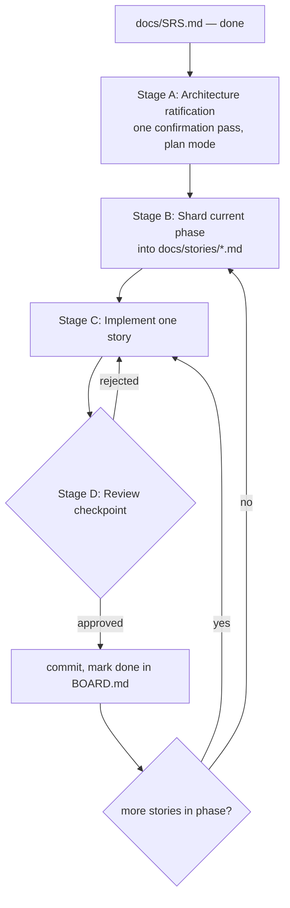

# Spec-Driven Delivery Workflow

How to turn [`docs/SRS.md`](SRS.md) into working code without either (a) full BMAD-style
ceremony (PM/Architect/SM/Dev/QA agent handoffs) or (b) full autopilot (one giant prompt,
no checkpoints, hope for the best). This is the middle path: **one planning pass, small
reviewable stories, a human checkpoint after every story.**

It works the same whether you're driving it yourself or handing prompts to another model
(Fable, a fresh Sonnet session, whatever) — every prompt below is self-contained and
references files in the repo, not this conversation.

## Roles

- **Operator** — you. Reads diffs, approves or rejects checkpoints, decides when to
  commit/push. Nothing merges without the operator's explicit go-ahead.
- **Agent** — whichever model/session is executing (Fable, Claude Code, etc). Implements
  exactly one story at a time, then stops.

## The loop



Each pass through the inner `C1 → D` loop touches one story, one review, one decision.
Never batch multiple stories into a single agent turn — that's how the original codebase
ended up with mocked metrics nobody caught for months.

---

## Stage A — Architecture ratification (once per phase, or once overall)

The SRS already contains a target architecture (§6). This stage isn't inventing a new
one — it's forcing a single explicit confirmation that the agent's *implementation plan*
for the phase matches it, before any code gets written.

**How:** put the session in Plan Mode (in Claude Code: `Shift+Tab` until the status line
shows plan mode), then paste:

```text
Read docs/SRS.md in full, especially §3 (audit baseline), §6 (target architecture),
§13 (migration roadmap), and §14 (traceability matrix).

Enter plan mode. Produce an implementation plan for Phase <N> of the migration roadmap
only (not the whole SRS). The plan should list the concrete changes you'd make, file by
file, and flag anything in §6's target architecture you think is wrong or worth
deviating from for this phase. Do not write code yet.
```

The agent proposes a plan and calls for your approval (`ExitPlanMode` in Claude Code).
Approve, or edit and re-approve. **This is the one confirmation pass** — after this you
move to sharding, not back-and-forth architecture debate per story.

---

## Stage B — Shard the phase into stories

A story is the smallest independently-reviewable unit: touches roughly ≤5 files, has one
clear verification command, and is completable in a single focused agent turn.

**Reference format:** [`docs/stories/STORY-001-fix-eval-video-path.md`](stories/STORY-001-fix-eval-video-path.md)
(already written, from Phase 0 — read it before generating more).

**Prompt to generate stories for the next phase** (documentation only, no plan mode needed):

```text
Read docs/SRS.md §13 Migration Roadmap Phase <N> and §14 Traceability Matrix.
Read docs/stories/STORY-001-fix-eval-video-path.md as the reference format and
docs/stories/BOARD.md as the reference board format.

Shard Phase <N> into individual story files under docs/stories/, one file per story,
named STORY-0XX-<slug>.md continuing the existing numbering.

Rules:
- One story = one reviewable unit: touches at most ~5 files, has one clear verification
  command, completable in a single focused session — not multi-day.
- Every story's frontmatter must cite the SRS requirement IDs and audit finding IDs it
  closes (srs_refs), taken from §14.
- **Verification-cost rule:** every verification command must complete in ≈2 minutes on
  this machine. Use the fixture clip (tests/data/tiny_clip.mp4, STORY-005) — never the
  full 213 MB dataset or a large model on CPU. If a story can't be verified cheaply,
  say so explicitly and mark verification as static/deferred rather than writing an
  expensive command nobody will run.
- Ground every story in the CURRENT tree, not the audit text: before writing a story,
  read the files it touches at HEAD and run `git status` — the audit snapshot may be
  stale (this exact failure produced a story for an already-fixed bug once).
- Declare ordering with a `depends_on:` frontmatter list when stories aren't independent.
- Do not implement anything yet. Only write the story markdown files, then append the
  new stories to docs/stories/BOARD.md as status: todo.
- Stop and give me a one-paragraph summary of the stories you created — don't start
  implementing.
```

Review the generated stories yourself before moving to Stage C — this is a cheap place
to catch a story that's actually two stories, or one that's missing a real verification
command.

---

## Stage C — Implement one story

**Prompt template** (swap in the story path):

```text
You are implementing exactly one story from a sharded spec. Read these in order:
1. docs/SRS.md — full spec, for context only. Do not implement beyond this story's scope.
2. docs/WORKFLOW.md — the process you must follow (this file).
3. docs/stories/STORY-0XX-<slug>.md — the story you are implementing now.

Rules:
- **Rule 0 — re-validate before implementing:** read every file the story references
  and confirm the problem still exists at HEAD, and check `git status` for uncommitted
  drift in those files. If the story is already implemented, partially implemented, or
  the code has drifted from the story's description, STOP — report what you found and
  propose a story update. Do not "re-fix" working code.
- If the story's "Suggested Approach" is non-trivial, or you see a materially better
  path, enter plan mode and stop for my approval before writing code. If the approach is
  already fully specified and low-risk (a one/two-file fix), implement directly —
  don't force plan mode on trivial stories.
- The incumbent models/stack (YOLOv8 weights, `deep_sort_realtime`, the custom
  optimizers, …) are not sacred. If a demonstrably better model or library serves a
  story's goal, propose the swap — state what improves and what it costs, and get the
  operator's yes before switching. (Operator directive 2026-07-19; SRS §6.5 already
  points this way: "YOLOv8 **or current YOLO11**", `supervision` for ByteTrack, Optuna
  baseline.)
- Stay inside the story's stated scope. If you notice unrelated issues, don't fix them —
  list them in your final report instead so they can be shredded into new stories.
- When done, run the story's Verification command(s) and show me the output.
- Update the story file's `status` frontmatter to `review` and update its row in
  docs/stories/BOARD.md.
- Stop. Do not start the next story without my explicit go-ahead.
```

---

## Stage D — Review checkpoint (operator does this, not the agent)

Before approving, check:

- [ ] Agent's report confirms it re-validated the story against HEAD (Rule 0) — if it
      jumped straight to implementing, check extra carefully for re-fixes of working code
- [ ] Diff touches only what the story scoped — no drive-by refactors
- [ ] Verification command was actually run and its output is shown, not asserted
- [ ] Every acceptance-criteria checkbox in the story is genuinely satisfied
- [ ] Run `/code-review` on the diff for correctness bugs before merging anything non-trivial
- [ ] If runtime/UI behavior changed, confirm it was actually exercised (the `verify`
      skill / manual run), not just "tests pass"
- [ ] No destructive git operations (history rewrites, force-push) happened without your
      explicit sign-off — flag these as separate stories requiring confirmation, don't
      let an agent bundle them into a routine cleanup story

**Approved →** commit (one commit per story is a good default), mark `done` in
`docs/stories/BOARD.md`, move to the next `todo` story.

**Rejected →** leave status `in-progress`, give specific feedback, re-run the Stage C
prompt in the same or a fresh session (the story file carries all the context needed —
that's the point of sharding).

When every story in the phase is `done`, go back to **Stage A** for the next phase.

---

## Handing this to another model (Fable, etc.)

Nothing above is Claude-Code-specific except the plan-mode keybinding. Any agent with
file read/write and the ability to run shell commands can follow this — the prompts are
self-contained and point at files in the repo, not at this conversation. Just:

1. Point the new session at this repo.
2. Give it the Stage C prompt for the first `todo` story on the board.
3. Review, approve, repeat.

Don't skip Stage D because the agent sounds confident — confidence isn't verification.

---

## Worked example: Phase 0 is already sharded

[`docs/stories/BOARD.md`](stories/BOARD.md) lists the Phase 0 stories in dispatch
order. **Order matters** — respect each story's `depends_on` frontmatter:

1. `STORY-000` — stabilize git state (the tree has ~18 files of uncommitted drift, a
   phantom nested repo tree, tracked `.pyc` files, and the entire HPO layer untracked;
   nothing else can run safely on top of that).
2. `STORY-003` — dependency manifest + pinned Python env (no working environment exists
   on this machine; every later verification command needs one).
3. `STORY-002` — hygiene deletions (safe only after 000 commits a baseline).
4. `STORY-005` — tiny fixture clip + smoke test (unblocks cheap verification forever).
5. `STORY-004` — fourcc fix (static verification only; runtime check deferred to the
   Phase-1 ByteTrack story).

`STORY-001` is already `done` — it was found fully implemented in the working tree
before dispatch. That discovery is why Stage C Rule 0 (re-validate against HEAD)
exists.
